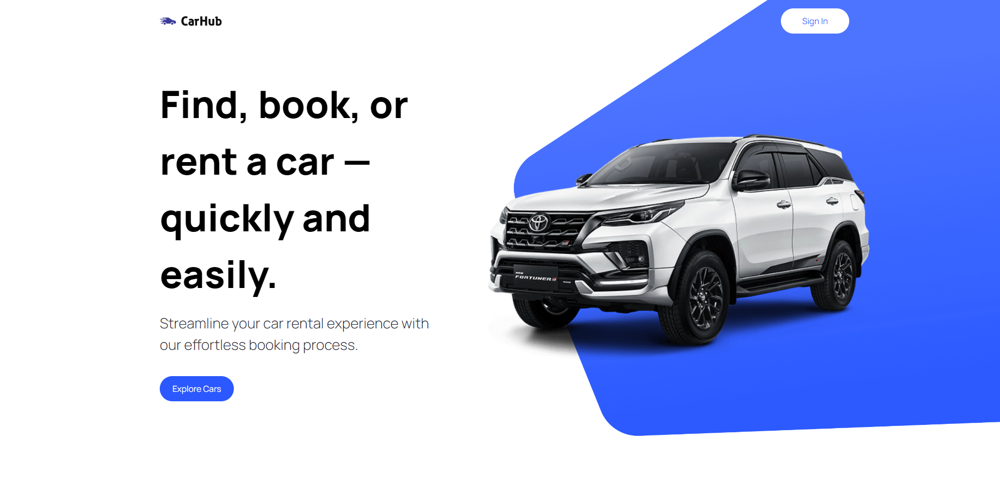

<a name="readme-top"></a>
<div align="center">

  
  

  <h1>CarHub</h1>
  
  <p>
  Easily find detailed specifications for any vehicle - a modern Next.js 13 Application using TypeScript 🏎
  </p>

<!-- Badges -->
<p>
  <a href="https://github.com/ladunjexa/Nextjs-CarHub-Web/graphs/contributors">
    
  </a>
  <a href="">
    
  </a>
  <a href="https://github.com/ladunjexa/Nextjs-CarHub-Web/network/members">
    
  </a>
  <a href="https://github.com/ladunjexa/Nextjs-CarHub-Web/stargazers">
    
  </a>
  <a href="https://github.com/ladunjexa/Nextjs-CarHub-Web/issues/">
    
  </a>
  <a href="https://github.com/ladunjexa/Nextjs-CarHub-Web/blob/master/LICENSE">
    
  </a>
</p>
   
 <h4>
    <a href="https://nextjs-car-hub-web.vercel.app/">View Demo</a>
  <span> · </span>
    <a href="https://github.com/ladunjexa/Nextjs-CarHub-Web">Documentation</a>
  <span> · </span>
    <a href="https://github.com/ladunjexa/Nextjs-CarHub-Web/issues/">Report Bug</a>
  <span> · </span>
    <a href="https://github.com/ladunjexa/Nextjs-CarHub-Web/issues/">Request Feature</a>
  </h4>
</div>

<br />

<!-- Table of Contents -->
<details>

<summary>

# :notebook_with_decorative_cover: Table of Contents

</summary>

- [About the Project](#star2-about-the-project)
  * [Folder Structure](#bangbang-folder-structure)
  * [Tech Stack](#space_invader-tech-stack)
- [Getting Started](#toolbox-getting-started)
  * [Environment Variables](#key-environment-variables)
  * [Installation](#gear-installation)
  * [Run Locally](#running-run-locally)
- [Contributing](#wave-contributing)
- [License](#warning-license)
- [Contact](#handshake-contact)
- [Acknowledgements](#gem-acknowledgements)

</details>  

<!-- About the Project -->
## :star2: About the Project

<div align="center">
  
</div>
<br />

Discover the perfect ride for you with our advanced car search engine. Easily find detailed specifications for any brand, model, year, and fuel type.

<!-- Folder Structure -->
### :bangbang: Folder Structure

Here is the folder structure of CarHub.
```bash
Nextjs-CarHub-Web/
|- app/
    |-- globals.css
    |-- layout.css
    |-- page.tsx
|- components/
    |-- CarCard.tsx
    |-- CardDetails.tsx
    |-- CustomButton.tsx
    |-- CustomFilter.tsx
    |-- Footer.tsx
    |-- Hero.tsx
    |-- Navbar.tsx
    |-- SearchBar.tsx
    |-- SearchManufacturer.tsx
    |-- ShowMore.tsx
    |-- index.ts
|- data/
    |-- index.ts
|- types/
    |-- index.ts
|- utils/
    |-- index.ts
|- public/
|- next-env.d.ts
|- next.config.js
|- postcss.config.js
|- tailwind.config.js
|- package.json
|- tscnofig.json
```
<br />

<!-- TechStack -->
### :space_invader: Tech Stack


<p align="right">(<a href="#readme-top">back to top</a>)</p>

<!-- Getting Started -->
## :toolbox: Getting Started

<!-- ENV VARIABLES -->
### :key: Environment Variables

In order to use CarHub you have to create [Cars By Ninja-API](https://rapidapi.com/apininjas/api/cars-by-api-ninjas) api key, and [IMAGIN.studio](https://imagin.studio/) account, to run this webapp, you will need to add the following environment variables to your .env file, which need to be located in root directory.

```env
RAPID_API_KEY=<RAPID_API_KEY> // Cars By Ninja-API
RAPID_API_HOST=<RAPID_API_HOST> // Cars By Ninja-API
IMGIN_API_CUSTOMER=<IMGIN_CUSTOMER>
```

<!-- Installation -->
### :gear: Installation

#### Step 1:
Download or clone this repo by using the command below:

```bash
 https://github.com/ladunjexa/Nextjs-CarHub-Web.git
```

#### Step 2:

This webapp using NPM (Node Package Manager), therefore, make sure that Node.js is installed by execute the following command in console:

```bash
  node -v
```

#### Step 3:

In root folder execute the following command to get the required packages:

```bash
  npm install
```

<!-- Run Locally -->
### :running: Run Locally

#### Step 1:

Go to root folder and execute the following command in order to run the webapp:

```bash
  npm run dev
```

<p align="right">(<a href="#readme-top">back to top</a>)</p>

<!-- Contributing -->
## :wave: Contributing

<a href="https://github.com/ladunjexa/Nextjs-CarHub-Web/graphs/contributors">
  
</a>


Contributions are always welcome!

See [`contributing.md`](https://contributing.md/) for ways to get started.

Contributions are what make the open source community such an amazing place to learn, inspire, and create. Any contributions you make are **greatly appreciated**.

If you have a suggestion that would make this better, please fork the repo and create a pull request. You can also simply open an issue with the tag "enhancement".
Don't forget to give the project a star! Thanks again!

1. Fork the Project
2. Create your Feature Branch (`git checkout -b feature/AmazingFeature`)
3. Commit your Changes (`git commit -m 'Add some AmazingFeature'`)
4. Push to the Branch (`git push origin feature/AmazingFeature`)
5. Open a Pull Request

<p align="right">(<a href="#readme-top">back to top</a>)</p>

<!-- License -->
## :warning: License

Distributed under the MIT License. See [LICENSE.txt](https://github.com/ladunjexa/Nextjs-CarHub-Web/blob/main/LICENSE) for more information.

<p align="right">(<a href="#readme-top">back to top</a>)</p>

<!-- Contact -->
## :handshake: Contact

Liron Abutbul - [@lironabutbul6](https://twitter.com/lironabutbul6) - [@ladunjexa](https://t.me/ladunjexa)

Project Link: [https://github.com/ladunjexa/Nextjs-CarHub-Web](https://github.com/ladunjexa/Nextjs-CarHub-Web)

<p align="right">(<a href="#readme-top">back to top</a>)</p>

<!-- Acknowledgments -->
## :gem: Acknowledgements

This section used to mention useful resources and libraries that used in CreativAI Webapp:
- [Next.js](https://nextjs.org/)
- [TypeScript](https://www.typescriptlang.org/)
- [React.js](https://reactjs.org/)
- [Tailwind CSS](https://tailwindcss.com/)
- [Headless UI](https://headlessui.com/)
- #JSMastery

<p align="right">(<a href="#readme-top">back to top</a>)</p>
